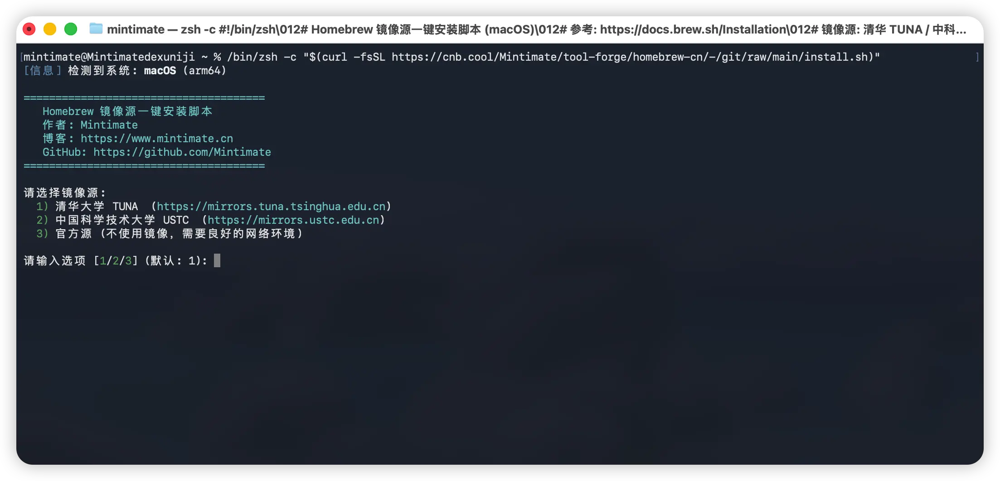
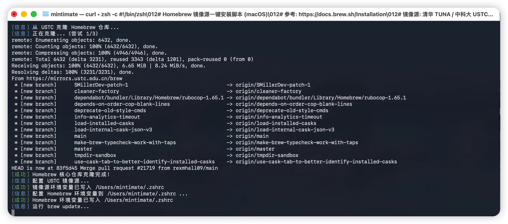
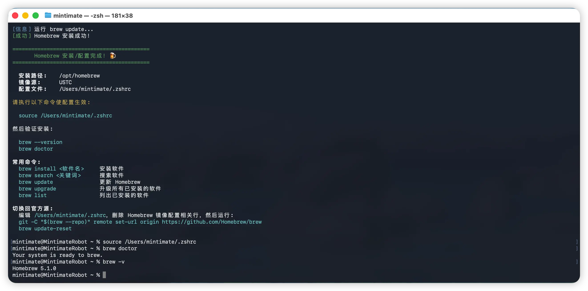

# 🍺 Homebrew 镜像一键安装脚本

> 使用镜像源快速安装 Homebrew 的一键脚本，内置清华 TUNA / 中科大 USTC / 阿里云等镜像源，并提供 homebrew-cn Agent 辅助排查安装、镜像源、软件包和本地环境问题。

## ✨ 功能特性

- 🪞 **镜像源可选** — 支持中科大 USTC、阿里云 Aliyun、清华 TUNA、官方源四选一
- 🖥️ **macOS 全架构** — 兼容 Intel (x86_64) 和 Apple Silicon (M1/M2/M3/M4)
- 🐚 **多 Shell 支持** — 自动适配 Zsh（默认）/ Bash，写入对应配置文件
- 🔍 **智能检测** — 自动检测系统架构、前置依赖（git、curl 等）
- 🔄 **已安装适配** — 已有 Homebrew 时可仅重新配置镜像源
- 🗑️ **一键卸载** — 内置完整卸载功能，自动清理软件包、目录和环境变量
- 💾 **自动备份** — 修改 Shell 配置文件前自动创建备份
- 🤖 **AI Agent 辅助** — 支持 Homebrew 安装问答、在线镜像检测、软件包查询和本地环境诊断

## 🚀 快速开始

### 方式一：在线一键安装（推荐）

```zsh
/bin/zsh -c "$(curl -fsSL https://brew-cn.mintimate.cn/install)"
```

如果无法访问 GitHub，也可以先将脚本下载到本地后运行：

```zsh
curl -fsSL -o install.sh https://brew-cn.mintimate.cn/install
/bin/zsh install.sh
```

### 方式二：克隆仓库后运行

```zsh
git clone https://cnb.cool/Mintimate/tool-forge/homebrew-cn
cd homebrew-cn
/bin/zsh install.sh
```

### 卸载 Homebrew

脚本内置了完整的卸载功能，会自动卸载所有已安装的软件包、清理安装目录及缓存、移除 Shell 配置文件中的 Homebrew 环境变量，并在操作前自动备份配置文件。

在线执行：

```zsh
/bin/zsh -c "$(curl -fsSL https://brew-cn.mintimate.cn/install)" -- --uninstall
```

本地执行：

```zsh
/bin/zsh install.sh --uninstall
```

> 脚本会列出当前已安装的软件包数量，需输入 `yes` 确认后才开始卸载，不会误操作。

## 📋 使用流程

运行脚本后，按提示操作即可：



```
======================================
   Homebrew 镜像源一键安装脚本
   作者: Mintimate
   博客: https://www.mintimate.cn
   GitHub: https://github.com/Mintimate
======================================

请选择镜像源:
  1) 中国科学技术大学 USTC  (https://mirrors.ustc.edu.cn)
  2) 阿里云 Aliyun  (https://mirrors.aliyun.com/homebrew/)
  3) 清华大学 TUNA  (https://mirrors.tuna.tsinghua.edu.cn)
  4) 官方源 (不使用镜像，需要良好的网络环境)

请输入选项 [1/2/3/4] (默认: 1):
```

安装过程中，脚本会自动配置环境变量并下载 Homebrew：



安装完成后，执行以下命令使配置生效：



```zsh
source ~/.zshrc
```

验证安装：

```zsh
brew --version
brew doctor
```

## 🤖 homebrew-cn Agent

项目内置 `homebrew-cn Agent`，用于处理 Homebrew 相关的安装、镜像源、软件包和本地环境排查问题。Agent 托管在 EdgeOne Makers，接口路径为 `/chat`，通过 SSE 流式返回 `thinking`、`tool_call`、`tool_result`、`ai_response` 和 `usage` 等事件。

特别感谢 **EdgeOne Makers Agent** 提供的 Agent 托管、构建和部署能力，让这个项目可以把原本单纯的安装脚本扩展为一个带实时工具调用、连续会话和流式响应的 Homebrew 排障助手。

### EdgeOne Makers Agent 实践

这个 Agent 按照 EdgeOne Makers 的项目形态组织：静态站点、Cloud Functions 和 Agent endpoint 共存在同一个仓库里，Agent 相关代码集中放在 `agents/chat/`，部署时由 Makers 统一完成依赖安装、构建和发布。

- **框架声明清晰**：在 `edgeone.json` 中声明 `agents.framework = "openai-agents-sdk"`，并将 `openai`、`@openai/agents` 放入 `externalNodeModules`，让 Makers 按 Agent 项目构建。
- **业务逻辑和运行时解耦**：`agents/chat/index.ts` 只负责请求入口、SSE 流、会话和工具编排；确定性的网络检测、软件包查询和环境分析放在 `_tools.ts`。
- **配置不进代码**：模型网关、模型名称、Referer、标题等都通过环境变量注入，部署环境只需要配置 `AI_GATEWAY_*`。
- **优先流式返回**：Agent 使用 SSE 输出渐进式结果，前端可以尽早展示状态、工具调用和最终回答，避免长时间空白等待。
- **善用 Makers 能力**：多轮对话通过 `makers-conversation-id` 维持 session；需要真实网络探测时使用 Makers sandbox，而不是让模型猜测镜像状态。
- **文档即行为规范**：`skills/homebrew-cn-agent/` 是 Agent 行为规范的维护入口；构建前用 `npm run sync:agent-skill` 生成 `agents/chat/_skill.ts`，保证部署产物可以稳定读取。
- **部署前可验证**：`npm run build` 会自动同步 skill 并生成部署产物；部署后用预览 URL 调用 `/chat` 做 smoke test，确认 Agent endpoint、SSE 和环境变量都正常。

## 🪞 镜像源说明

| 镜像源 | Git 仓库 | 二进制瓶 (Bottles) | API |
|--------|----------|-------------------|-----|
| **USTC** | `mirrors.ustc.edu.cn/brew.git` | `mirrors.ustc.edu.cn/homebrew-bottles` | `mirrors.ustc.edu.cn/homebrew-bottles/api` |
| **阿里云** | `mirrors.aliyun.com/homebrew/brew.git` | `mirrors.aliyun.com/homebrew/homebrew-bottles` | `mirrors.aliyun.com/homebrew/homebrew-bottles/api` |
| **清华 TUNA** | `mirrors.tuna.tsinghua.edu.cn/git/homebrew/brew.git` | `mirrors.tuna.tsinghua.edu.cn/homebrew-bottles` | `mirrors.tuna.tsinghua.edu.cn/homebrew-bottles/api` |

脚本会自动配置以下环境变量：

```bash
export HOMEBREW_BREW_GIT_REMOTE="..."       # brew 主仓库
export HOMEBREW_CORE_GIT_REMOTE="..."       # homebrew-core 仓库
export HOMEBREW_BOTTLE_DOMAIN="..."         # 预编译二进制包下载地址
export HOMEBREW_API_DOMAIN="..."            # API 地址
export HOMEBREW_CASK_GIT_REMOTE="..."       # homebrew-cask 仓库
```

## 📍 安装路径

| 架构 | 安装路径 |
|------|----------|
| Apple Silicon (M1/M2/M3/M4) | `/opt/homebrew` |
| Intel (x86_64) | `/usr/local` |

## 🔄 切换回官方源

如果之后网络环境改善，想切换回官方源：

1. 编辑 `~/.zshrc`，删除 `# Homebrew 镜像配置` 相关行
2. 运行以下命令：

```zsh
git -C "$(brew --repo)" remote set-url origin https://github.com/Homebrew/brew
brew update-reset
```

## ❓ 常见问题

### Q: 安装后执行 `brew` 提示 "command not found"

A: 请先执行 `source ~/.zshrc` 使环境变量生效，或重新打开终端。

### Q: `brew update` 时报 Git 相关错误

A: 尝试执行：

```zsh
brew update-reset
```

### Q: 想更换镜像源怎么办？

A: 重新运行安装脚本，选择新的镜像源即可。脚本会自动清理旧配置并写入新配置。

### Q: macOS 提示需要安装 Xcode Command Line Tools

A: 脚本会自动触发安装，请在弹出的对话框中点击"安装"，安装完成后重新运行脚本。

### Q: 如何卸载 Homebrew？

A: 使用脚本自带的卸载功能（推荐）：

```zsh
/bin/zsh -c "$(curl -fsSL https://brew-cn.mintimate.cn/install)" -- --uninstall
```

也可以使用官方卸载脚本：

```bash
/bin/bash -c "$(curl -fsSL https://raw.githubusercontent.com/Homebrew/install/HEAD/uninstall.sh)"
```

如果脚本都无法运行，可以手动删除并移除环境变量内相关配置：

```bash
# Apple Silicon
sudo rm -rf /opt/homebrew

# Intel (x86_64)
sudo rm -rf /usr/local/Homebrew
sudo rm -rf /usr/local/Caskroom
sudo rm -rf /usr/local/Cellar
sudo rm -rf /usr/local/bin/brew

# 通用缓存清理
rm -rf ~/Library/Caches/Homebrew
rm -rf ~/Library/Logs/Homebrew
```

## 🧑‍💻 开发与部署

### 安装依赖

```bash
npm install
```

### 同步 Agent Skill

修改 `skills/homebrew-cn-agent/SKILL.md` 或 `skills/homebrew-cn-agent/references/*.md` 后，运行：

```bash
npm run sync:agent-skill
```

该命令会生成 `agents/chat/_skill.ts`。不要直接手改 `_skill.ts`；需要调整 Agent 行为时请改 skill 文档。

### 构建与类型检查

```bash
npm run build
npm run typecheck
```

`npm run build` 会自动执行 skill 同步，然后生成 Cloud Functions 和静态资源所需文件。

### EdgeOne Makers 部署

```bash
edgeone makers deploy -n homebrew-cn -t '<EDGEONE_MAKERS_TOKEN>'
```

部署完成后，可用返回的预览地址调用 `/chat` 做 smoke test。预览地址通常会先通过 `eo_token` / `eo_time` 写入 Cookie，再跳转到实际路径；如果使用 `curl` 测试，需要保留 Cookie 并保持 POST body：

```bash
curl -c /tmp/homebrew-cn-cookie.txt \
  -b /tmp/homebrew-cn-cookie.txt \
  -L --post302 -N \
  'https://<preview-domain>/chat?eo_token=<token>&eo_time=<time>' \
  -H 'Content-Type: application/json' \
  -H 'makers-conversation-id: smoke-001' \
  -d '{"message":"Homebrew 怎么安装？"}'
```

## 🔗 参考链接

- [Homebrew 官方安装文档](https://docs.brew.sh/Installation)
- [清华 TUNA Homebrew 镜像帮助](https://mirrors.tuna.tsinghua.edu.cn/help/homebrew/)
- [中科大 USTC Homebrew 镜像帮助](https://mirrors.ustc.edu.cn/help/brew.git.html)
- [Homebrew 官网](https://brew.sh/)

## 📄 许可证

MIT License
