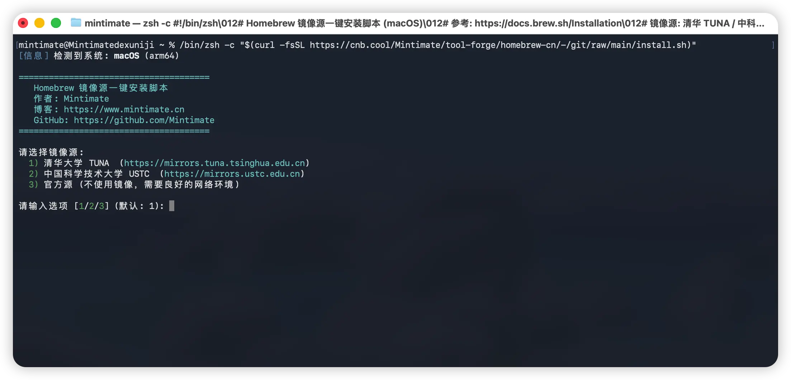
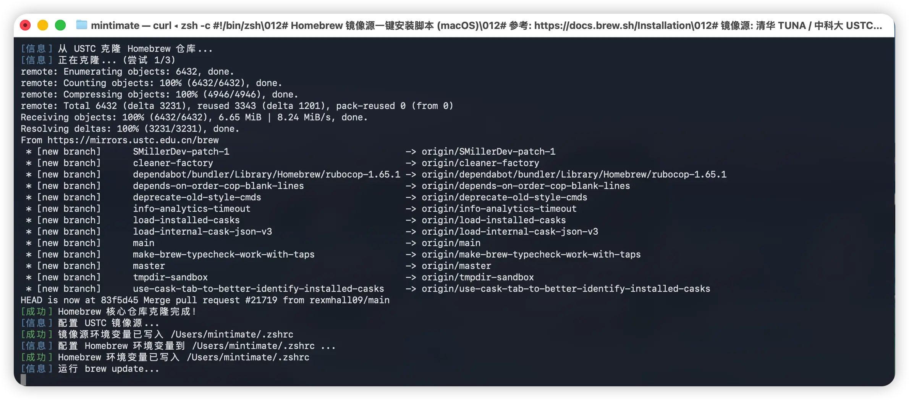
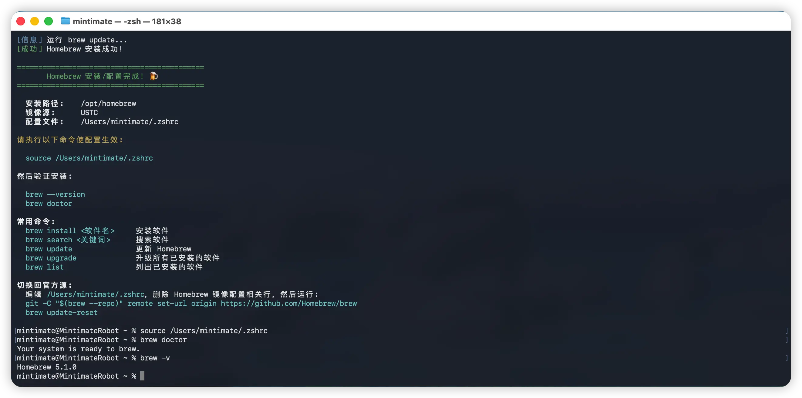

# 🍺 Homebrew CN 安装与镜像配置

> 面向国内用户的 Homebrew 安装、镜像配置与中文排障入口。支持 macOS / Linux，并通过 Homebrew 自身的 `brew.env` 配置兼容官方桌面端 BrewUI。

## ✨ 功能特性

- 🪞 **镜像源可选** — 支持中科大 USTC、阿里云 Aliyun、清华 TUNA、官方源四选一
- 🖥️ **平台检查** — 区分 Apple Silicon、Intel 与 Linux；提示 Homebrew 7 的系统支持限制
- 🐚 **多 Shell 支持** — 自动适配 Zsh（默认）/ Bash，写入对应配置文件
- 🔍 **智能检测** — 自动检测系统架构、前置依赖（git、curl 等）
- 🔄 **已有安装换源** — `--configure` 只配置已有 Homebrew，不重复走完整安装前置检查
- 🪟 **桌面端配置** — 镜像写入安装前缀下的 `etc/homebrew/brew.env`，供终端和 BrewUI 使用
- 🗑️ **一键卸载** — 内置完整卸载功能，自动清理软件包、目录和环境变量
- 💾 **自动备份** — 修改 Shell 配置文件前自动创建备份
- 🤖 **AI Agent 辅助** — 支持安装问答、云端镜像检测、软件包查询和用户提供的本地环境信息分析

## 🚀 快速开始

### 首次安装 Homebrew

macOS：

```zsh
/bin/zsh -c "$(curl -fsSL https://brew-cn.mintimate.cn/install)"
```

Linux：

```bash
/bin/bash -c "$(curl -fsSL https://brew-cn.mintimate.cn/install)"
```

Homebrew 7 不再支持 macOS 10.15 及以下；Intel Mac 已进入 Tier 3，不保证提供新的预编译包。BrewUI 需要 macOS 26 或更高版本，不能把命令行 Homebrew 的支持范围等同于桌面端。参见 [Homebrew 7 发布说明](https://brew.sh/2026/09/13/homebrew-7.0.0/)。

如果无法访问 GitHub，也可以先将脚本下载到本地后运行：

```zsh
curl -fsSL -o install.sh https://brew-cn.mintimate.cn/install
/bin/zsh install.sh
```

### 已有 Homebrew，仅配置镜像

macOS：

```zsh
/bin/zsh -c "$(curl -fsSL https://brew-cn.mintimate.cn/install)" -- --configure
```

Linux：

```bash
/bin/bash -c "$(curl -fsSL https://brew-cn.mintimate.cn/install)" -- --configure
```

该模式要求本机已经安装 Homebrew；未找到时会退出，不会开始新安装。按提示选择镜像源，脚本备份并迁移旧镜像配置，保留无关设置。如果发现无法安全迁移的配置，会说明冲突位置，处理后可重新运行。

### 使用官方桌面端 BrewUI

在 macOS 26 或更高版本上，先完成 Homebrew 安装和镜像配置，再运行：

```zsh
brew install --cask homebrew-app
```

修改镜像配置后，完全退出并重新打开 BrewUI，在 Configuration 中核对实际配置。BrewUI 使用独立的 Shell 环境，不读取终端中的 `export` 和别名；单独执行 `source ~/.zshrc` 不会改变桌面端配置。参见 [BrewUI 配置说明](https://github.com/Homebrew/BrewUI/blob/main/ARCHITECTURE.md#homebrew-configuration)。

### 克隆仓库后运行

```zsh
git clone https://cnb.cool/Mintimate/tool-forge/homebrew-cn
cd homebrew-cn
/bin/zsh install.sh
```

### 卸载 Homebrew

脚本内置了完整的卸载功能，会自动卸载所有已安装的软件包、清理安装目录及缓存、移除 Shell 配置文件中的 Homebrew 环境变量，并在操作前自动备份配置文件。

在线执行：

```zsh
/bin/zsh -c "$(curl -fsSL https://brew-cn.mintimate.cn/install)" -- --uninstall
```

本地执行：

```zsh
/bin/zsh install.sh --uninstall
```

> 脚本会列出当前已安装的软件包数量，需输入 `yes` 确认后才开始卸载，不会误操作。

## 📋 使用流程

运行脚本后，按提示操作即可：



```
======================================
   Homebrew 镜像源一键安装脚本
   作者: Mintimate
   博客: https://www.mintimate.cn
   GitHub: https://github.com/Mintimate
======================================

请选择镜像源:
  1) 中国科学技术大学 USTC  (https://mirrors.ustc.edu.cn)
  2) 阿里云 Aliyun  (https://mirrors.aliyun.com/homebrew/)
  3) 清华大学 TUNA  (https://mirrors.tuna.tsinghua.edu.cn)
  4) 官方源 (不使用镜像，需要良好的网络环境)

请输入选项 [1/2/3/4] (默认: 1):
```

安装过程中，脚本会配置镜像并下载 Homebrew；旧截图仅用于展示终端操作，配置路径以当前脚本输出为准：



安装或迁移完成后，关闭并重新打开终端，以加载 PATH 并清除旧会话中的镜像变量；BrewUI 用户也需要重启应用：



验证安装：

```zsh
brew --version
brew doctor
```

## 🤖 homebrew-cn Agent

项目内置 `homebrew-cn Agent`，用于处理 Homebrew 相关的安装、镜像源、软件包和本地环境排查问题。Agent 托管在 EdgeOne Makers，接口路径为 `/chat`，通过 SSE 流式返回 `thinking`、`tool_call`、`tool_result`、`ai_response` 和 `usage` 等事件。

特别感谢 **EdgeOne Makers Agent** 提供的 Agent 托管、构建和部署能力，让这个项目可以把原本单纯的安装脚本扩展为一个带实时工具调用、连续会话和流式响应的 Homebrew 排障助手。

### EdgeOne Makers Agent 实践

这个 Agent 按照 EdgeOne Makers 的项目形态组织：静态站点、Cloud Functions 和 Agent endpoint 共存在同一个仓库里，Agent 相关代码集中放在 `agents/chat/`，部署时由 Makers 统一完成依赖安装、构建和发布。

- **框架声明清晰**：在 `edgeone.json` 中声明 `agents.framework = "openai-agents-sdk"`，并将 `openai`、`@openai/agents` 放入 `externalNodeModules`，让 Makers 按 Agent 项目构建。
- **业务逻辑和运行时解耦**：`agents/chat/index.ts` 只负责请求入口、SSE 流、会话和工具编排；确定性的网络检测、软件包查询和环境分析放在 `_tools.ts`。
- **配置不进代码**：模型网关、模型名称等通过 `context.env` 注入，默认使用 Makers Models 的 `@makers/deepseek-v4-flash`；自定义网关可通过 `AI_GATEWAY_*` 覆盖。
- **优先流式返回**：Agent 使用 SSE 输出渐进式结果，前端可以尽早展示状态、工具调用和最终回答，避免长时间空白等待。
- **善用 Makers 能力**：多轮对话通过 `makers-conversation-id` 维持 session；需要真实网络探测时使用 Makers sandbox，而不是让模型猜测镜像状态。
- **文档即行为规范**：`skills/homebrew-cn-agent/` 是 Agent 行为规范的维护入口；构建前用 `npm run sync:agent-skill` 生成 `agents/chat/_skill.ts`，保证部署产物可以稳定读取。
- **部署前可验证**：`npm run build` 会自动同步 skill 并生成部署产物；部署后用预览 URL 调用 `/chat` 做 smoke test，确认 Agent endpoint、SSE 和环境变量都正常。

## 🪞 镜像源说明

| 镜像源 | Git 仓库 | 二进制瓶 (Bottles) | API |
|--------|----------|-------------------|-----|
| **USTC** | `mirrors.ustc.edu.cn/brew.git` | `mirrors.ustc.edu.cn/homebrew-bottles` | `mirrors.ustc.edu.cn/homebrew-bottles/api` |
| **阿里云** | `mirrors.aliyun.com/homebrew/brew.git` | `mirrors.aliyun.com/homebrew/homebrew-bottles` | `mirrors.aliyun.com/homebrew/homebrew-bottles/api` |
| **清华 TUNA** | `mirrors.tuna.tsinghua.edu.cn/git/homebrew/brew.git` | `mirrors.tuna.tsinghua.edu.cn/homebrew-bottles` | `mirrors.tuna.tsinghua.edu.cn/homebrew-bottles/api` |

镜像配置写入 `$(brew --prefix)/etc/homebrew/brew.env`。该文件使用字面量 `NAME=value`，不要添加 `export`、Shell 变量展开或命令替换：

```dotenv
HOMEBREW_BREW_GIT_REMOTE=https://mirrors.ustc.edu.cn/brew.git
HOMEBREW_BOTTLE_DOMAIN=https://mirrors.ustc.edu.cn/homebrew-bottles
HOMEBREW_API_DOMAIN=https://mirrors.ustc.edu.cn/homebrew-bottles/api
```

Shell 配置只负责通过 `brew shellenv` 设置命令搜索路径。用户级 `~/.homebrew/brew.env`、终端使用的 XDG 配置和系统级 `/etc/homebrew/brew.env` 也可能影响最终结果。系统或安装级配置中通过 `HOMEBREW_XDG_CONFIG_HOME` 指定的用户目录也会纳入迁移检查；不能安全解析的路径会在写入前提示处理。

USTC 已停止提供 `homebrew-core.git` / `homebrew-cask.git` 镜像，常规安装使用 API 获取软件包信息，不再设置这两个 Git 镜像地址。Bottles 与 API 镜像可用，不代表所有 Cask 应用的官方下载地址都能加速。在线镜像检测从服务器执行，结果不等于用户本地网络速度。

## 📍 安装路径

| 架构 | 安装路径 |
|------|----------|
| Apple Silicon | `/opt/homebrew` |
| Intel (x86_64) | `/usr/local` |
| Linux | `/home/linuxbrew/.linuxbrew` |

## 🔄 切换回官方源

重新运行配置模式，选择 `4`（官方源）：

```zsh
/bin/zsh -c "$(curl -fsSL https://brew-cn.mintimate.cn/install)" -- --configure
```

Linux 使用 `/bin/bash`。脚本会处理受支持的旧配置与 `brew.env` 中的镜像设置；完成后重新打开终端和 BrewUI，避免当前进程继续保留旧环境变量。不要仅删除 `.zshrc` 中的配置，否则 `brew.env` 仍可能继续生效。

## ❓ 常见问题

### Q: 安装后执行 `brew` 提示 "command not found"

A: 请先执行 `source ~/.zshrc` 使环境变量生效，或重新打开终端。

### Q: `brew update` 时报 Git 相关错误

A: 保留完整错误，先检查镜像连接和分支同步情况。Homebrew 7 使用 `main`，旧的 `master` 为过渡分支。脚本在更新或验证失败时会返回失败状态，不会把该结果显示为安装成功；可更换镜像后重试，或将错误交给 Agent 分析。

### Q: 想更换镜像源怎么办？

A: 使用 `--configure`，选择新的镜像源即可。旧版本用户也可通过此入口迁移到桌面端可用的 `brew.env` 配置。

### Q: 终端已经换源，BrewUI 还是下载慢

A: 检查是否仍只在 `.zshrc` 中设置镜像。使用配置模式完成迁移后，重启 BrewUI 并查看 Configuration。如果配置一致，再确认下载慢发生在 API、Bottle 还是具体应用的下载地址；云端 Git 镜像检测不能覆盖所有这些环节。

### Q: macOS 提示需要安装 Xcode Command Line Tools

A: 首次安装使用 CLI 路线，脚本会触发安装并等待完成；超时后可安装好 CLT 再重试。已有 Homebrew 的 `--configure` 模式不会重复执行完整前置安装检查。

### Q: 如何卸载 Homebrew？

A: 使用脚本自带的卸载功能（推荐）：

```zsh
/bin/zsh -c "$(curl -fsSL https://brew-cn.mintimate.cn/install)" -- --uninstall
```

也可以使用官方卸载脚本：

```bash
/bin/bash -c "$(curl -fsSL https://raw.githubusercontent.com/Homebrew/install/HEAD/uninstall.sh)"
```

如果脚本都无法运行，可以手动删除并移除环境变量内相关配置：

```bash
# Apple Silicon
sudo rm -rf /opt/homebrew

# Intel (x86_64)
sudo rm -rf /usr/local/Homebrew
sudo rm -rf /usr/local/Caskroom
sudo rm -rf /usr/local/Cellar
sudo rm -rf /usr/local/bin/brew

# 通用缓存清理
rm -rf ~/Library/Caches/Homebrew
rm -rf ~/Library/Logs/Homebrew
```

## 🧑‍💻 开发与部署

### 安装依赖

```bash
npm install
```

### 同步 Agent Skill

修改 `skills/homebrew-cn-agent/SKILL.md` 或 `skills/homebrew-cn-agent/references/*.md` 后，运行：

```bash
npm run sync:agent-skill
```

该命令会生成 `agents/chat/_skill.ts`。不要直接手改 `_skill.ts`；需要调整 Agent 行为时请改 skill 文档。

### Makers Models 配置

以 2026-09-16 的 Makers 官方文档为准，默认模型为 `@makers/deepseek-v4-flash`。
配置本地 `.env` 和控制台「项目设置 → 环境变量」：

```dotenv
AI_GATEWAY_API_KEY=<Makers Models API Key>
AI_GATEWAY_BASE_URL=https://ai-gateway.edgeone.link/v1
AI_GATEWAY_MODEL=@makers/deepseek-v4-flash
AI_GATEWAY_ENABLE_THINKING=true
```

- 在 Makers → Models → API Key 获取密钥；已有密钥只在创建时显示完整内容。
- 从自定义网关切回 Makers 时，必须同时更换 **API Key、Base URL、model**，不能只修改模型名。不要向 Makers 发送原自定义网关的密钥。
- 运行时只读取 `context.env`，不在代码或前端保存密钥。本地 `.env` 已被 Git 忽略；请勿覆盖已有配置而遗失原密钥。
- 主回答按问题复杂度决定是否思考。DeepSeek 使用 `thinking.type`；Qwen 使用 `chat_template_kwargs.enable_thinking`。意图分类固定关闭思考，避免 256 token 的分类输出预算被推理耗尽。
- DeepSeek 工具调用的 `reasoning_content` 会与 Agents SDK 的 `reasoning` 字段双向转换，保持多轮工具调用兼容。
- 控制台环境变量的修改在**下一次部署**生效；`.env.example` 不会自动更新线上配置。

官方说明：[Agent 快速开始](https://pages.edgeone.ai/zh/document/agents-quick-start)、[Models 概览](https://pages.edgeone.ai/zh/document/models)。

### 构建与类型检查

```bash
npm run build
npm run typecheck
npm test
```

`npm run build` 会自动执行 skill 同步，然后生成 Cloud Functions 和静态资源所需文件。

### EdgeOne Makers 部署

部署前先停止当前项目的 `edgeone makers dev`。开发热更新与生产打包共用 `.edgeone/`，同时运行可能覆盖生产云函数产物（例如混入本地监听端口），导致线上 `INTERNAL_CLOUD_FUNCTION_NOT_READY`。不要通过手改生成文件修复，应停止开发服务后重新构建部署。

```bash
edgeone makers deploy -n homebrew-cn -t '<EDGEONE_MAKERS_TOKEN>'
```

部署完成后，可用返回的预览地址调用 `/chat` 做 smoke test。预览地址通常会先通过 `eo_token` / `eo_time` 写入 Cookie，再跳转到实际路径；如果使用 `curl` 测试，需要保留 Cookie 并保持 POST body：

```bash
curl -c /tmp/homebrew-cn-cookie.txt \
  -b /tmp/homebrew-cn-cookie.txt \
  -L --post302 -N \
  'https://<preview-domain>/chat?eo_token=<token>&eo_time=<time>' \
  -H 'Content-Type: application/json' \
  -H 'makers-conversation-id: smoke-001' \
  -d '{"message":"Homebrew 怎么安装？"}'
```

## 🔗 参考链接

- [Homebrew 官方安装文档](https://docs.brew.sh/Installation)
- [Homebrew 7 发布说明](https://brew.sh/2026/09/13/homebrew-7.0.0/)
- [BrewUI 配置说明](https://github.com/Homebrew/BrewUI/blob/main/ARCHITECTURE.md#homebrew-configuration)
- [清华 TUNA Homebrew 镜像帮助](https://mirrors.tuna.tsinghua.edu.cn/help/homebrew/)
- [中科大 USTC Homebrew 镜像帮助](https://mirrors.ustc.edu.cn/help/brew.git.html)
- [Homebrew 官网](https://brew.sh/)

## 📄 许可证

MIT License
